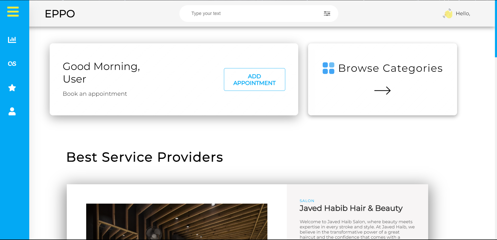

# Eppo

<br/>

<p align="center">
  
</p>

<p align="center">
  <br />
  <br />
  <a href="#table-of-contents"><b>Explore the docs »</b></a>
  <br />
  <br />
  <a href="#demonstration">Features</a>
  &nbsp;&nbsp;·&nbsp;&nbsp;
  <a href="#contributing">Local Setup</a>
  <br />
</p>

## Table Of Contents

- [About the Project](#about-the-project)
- [Demonstration & Features](#demonstration)
- [Technologies Used](#technologies-used)
- [Contributing](#contributing)
<!-- - [License](#license) -->
- [Authors](#authors)

## About The Project

Eppo is a platform that offers a contactless solution for booking physical appointments with professionals such as doctors, lawyers, therapists, barbers, and more. However, long wait times, scheduling conflicts, and inefficient appointment management can create frustration for clients and professionals alike.

<!-- Objectives:

- To offer a wide selection of high-quality gardening products and accessories at competitive prices.
- To offer a secure & reliable platform for online transactions, ensuring that customer information are protected.
- To establish long-term relationships with nursery partners to ensure a reliable and consistent supply of high-quality products.
- To provide a seamless and user-friendly shopping experience for customers.
- To expand the reach of the gardening community by making gardening products and resources accessible to people in urban areas. -->

## Demonstration

<br />

**Landing Page**

<p align="left">
  
  
  
</p>

<br />
<br />

**Register & Login**
<br />

<table>
    <tr>
        <td>
            
        </td>
        <td>
            
        </td>
    </tr>
    <tr>
        <td>
          <p>User Registration.</p>
        </td>
        <td>
          <p>User Login to start the shopping.</p>
        </td>
    </tr>
</table>

<br />

**User Dashboard**

<p align="left">
  
  
</p>

<br />
<br />

**Categories**

<p align="left">
 
</p>

<br />
<br />

**Single Category shop**

<p align="left">
  
</p>

<br />

**Single Category shop detail page**

<p align="left">
  
</p>

<br />

### Technologies Used

- Frontend
  - React.js
  - CSS
- Backend
  - Node.js (Express.js)
  - MongoDB

<br />

## Contributing

**Local Setup || Project Structure**

NOTE: Individual instructions can be found in respective directories.

- The project contains 4 broad directories.

```
*
├───client
└───server
```

- `client`: The frontend for the application.
- `server`: The backend for the application.

<br />

**Client**

For local setup of frontend:

- `cd client`
- `npm i`
- `npm start`
- Go to `localhost:3000`

Structure

```
src
├───Components
├───Pages
├───redux
├───App.js
└───index.js
```

Individual Component & Pages Structure

```
component
├───component.jsx
└───component.css
```

```
Pages
├───page.jsx
└───page.css
```

<br />
<br />

**Server**

For local setup of backend:

- `cd server`
- `npm i`
- `npm start`

```
server
├───controllers
├───models
├───routes
├───utils
├───index.js
└───package.json
```

<br />
<br />

## Authors

- Om Shete
  - [LinkedIn](https://www.linkedin.com/in/om-shete-25748522a/)
- Mohib Abbas Sayed
  - [LinkedIn](https://www.linkedin.com/in/mohib-abbas-sayed-83837422a/?utm_source=share&utm_campaign=share_via&utm_content=profile&utm_medium=android_app)
- Hamza Sayyed
  - [LinkedIn](https://shorturl.at/hjAEI)
- Parth Puranik
